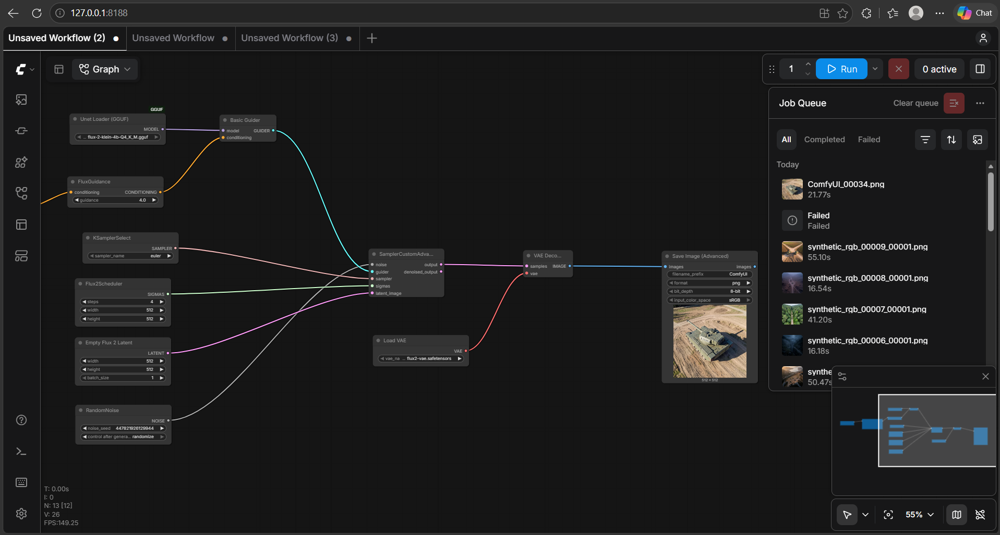
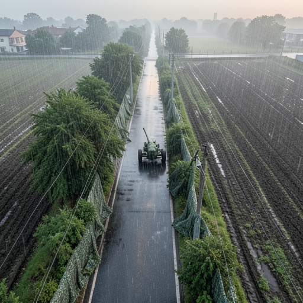
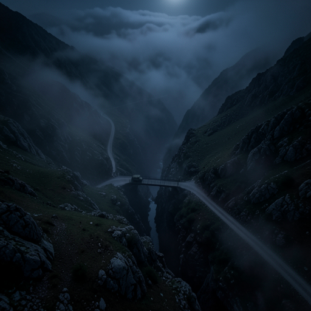

# synthetic_rgb_generator

 AI generated Images 

#Gemini for scenario to prompt

PS C:\Users\DIWANSU PILANIA\Desktop\tut\synthetic_rgb_generator> $env:GEMINI_API_KEY="..............................."

PS C:\Users\DIWANSU PILANIA\Desktop\tut\synthetic_rgb_generator> python app.py 

#Local host Comfyui FLUX2 for image generation  

PS C:\AI\ComfyUI_windows_portable> .\python_embeded\python.exe -s ComfyUI\main.py --windows-standalone-build

 SCENARIO:
{
  "camera_type": "narrow_rgb",
  "altitude_m": 750,
  "viewpoint": "near_nadir",
  "object_class": "artillery",
  "object_count": 1,
  "object_size": "small",
  "terrain": "agricultural",
  "lighting": "dawn",
  "weather": "rainy",
  "object_arrangement": "clustered",
  "occlusion": "high",
  "image_quality": "atmospheric_haze",
  "scene_context": "urban street"
}

SCENARIO:
{
  "camera_type": "wide_rgb",
  "altitude_m": 1000,
  "viewpoint": "nadir",
  "object_class": "military_bridge",
  "object_count": 1,
  "object_size": "small",
  "terrain": "mountainous",
  "lighting": "night",
  "weather": "foggy",
  "object_arrangement": "random",
  "occlusion": "medium",
  "image_quality": "atmospheric_haze",
  "scene_context": "mountain road"
}

